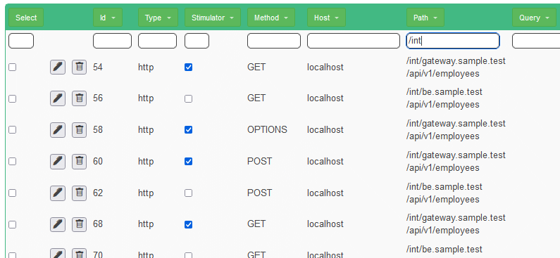

## Automatically test and verify backend

### Run the interaction with back-end (stateless) and test the GATEWAY in isolation

* Stop the application and restart!
* Delete the script and re-upload Sample.json
* Stop the "fe" application
* Stop the "be" application

* Select all the calls to path /int/gateway.sample.test with the filter and set them as "Stimulator". These will be run automatically.

* Run the test
* Check the results on the results tab!

### Verify the content structure

* Select all the "Stimulator" calls (use "true" as filter on the "Stimulator" column)
* Use the global Edit JS and set for all call the verification script in the "post" part

<pre>
    var diffEngine = new org.kendar.xml.DiffInferrer();
    diffEngine.diff(expectedresponse.getResponseText(),response.getResponseText());
    if(expectedresponse.getStatusCode()!=response.getStatusCode()){
        throw "Expected status code "+expectedresponse.getStatusCode()+" but received "+response.getStatusCode();
    }
</pre>

* Replay And be happy
* Check the [results](http://www.local.test/plugins/recording/results.html)!
* Download and save the script as NullAutoTestGateway.json

### Fail the test! To verify it's real

* Find the response to a front-end call. A good example can be the first get call to the "/int/gateway.sample.test/api/v1/employees" after the POST inserting the new employee

* Click on the Edit button on the list and open the Request/Response editor

* Replace then the response data with something like this. Adding the field "unexpected"

<pre>
[{"id":1,"name":"John","role":"Doe","unexpected":"field"}]
</pre>

* Run the test again
* Check the FAILED results! Notice that the field "unexpected" is the one we added!

