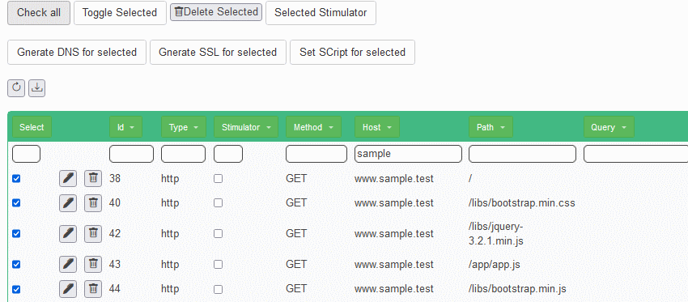

## Automatically test and verify backend

### Run the interaction with back-end (stateless)

* Stop the application and restart!
* Delete the script and re-upload Sample.json
* Stop the "fa" application
* Stop the "gateway" application
* Select all the calls to http://www.sample.test with the filter and set them as "Stimulator"

* Select all the calls to http://localhost/int/gateway.sample.test with the filter and set them as "Stimulated"

* Add the verification of the message on the "Stimulator" page
* Download and save the script as PactFe.json
* Run the pact test
* Check the results!

### Fail the test!

* Find the response to a front-end call
* Insert in the "response body" something fake like

<pre>
{"test":"fail"}
</pre>

* Run the pact test
* Check the FAILED results!

### Run the interaction back-end to back-end (stateful)

* Stop the application and restart!
* Delete the script and re-upload Sample.json
* Stop the "fa" application
* Stop the "gateway" application
* Select all the calls to http://localhost/int/be.sample.test with the filter and set them as "Stimulator"

* Select all the calls to http://localhost/int/gateway.sample.test with the filter and set them as "Stimulated"

* Add the verification of the message on the "Stimulator" page
* Download and save the script as PactBeStatic.json
* Run the pact test
* Check the results!
* Re-run it and... see errors

### Setup the statefulness

* Add variables here and there
* Download and save the script as PactBeDynamic.json
* Run the pact test
* Check the results!
* Re-run it multiple times and see Successes
