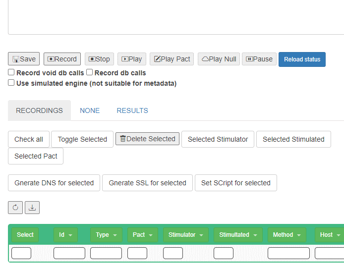

## Record some interaction

You can now check ham application going on http://localhost

* You can create a recording on the [recording page](http://www.local.test/plugins/recording)

* Once you create the recording you can start recording!

* Do some interaction on your application
* And stop the recording!
* Now you will se all the calls on the just created recording!

* "Download" the recording as "Sample.json"
