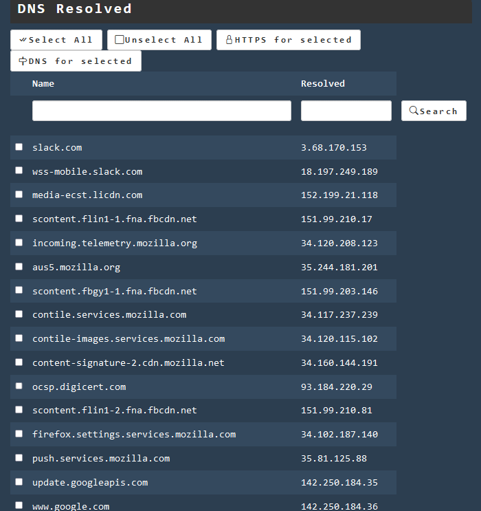

## Intercept Android

You can now use some app, browse some page. You can check the DNS names 
captured by ham [here](http://www.local.test/dns/resolved.html)

Notice how many stuffs your phone is accessing!
Here I used (to give an example). 

* Chrome
* Slack App
* Linkedin App