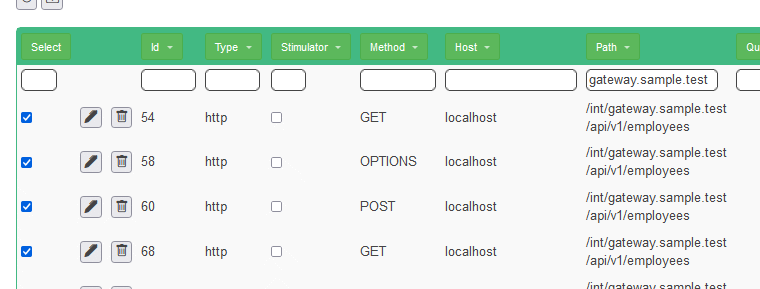

## Simulate the calendar back-end

### Test the interaction with back-end

* Stop the application and restart!
* Delete the script and re-upload Sample.json
* Select all the calls to http://www.sample.test with the filter and delete them all

* Select all the calls to http://localhost/int/gateway.sample.test with the filter and delete them all

* Stop the "be" application
* Stop the "gateway" application
* Download and save the script as NullFe.json
* Play the Script
* Do the navigation as you did while recording
* Everything will work as if be is up!

### Test the interaction with gateway

* Stop all the applications and restart!
* Delete the script and re-upload Sample.json
* Select all the calls to http://www.sample.test with the filter and delete them all

* Select all the calls to http://localhost/int/be.sample.test with the filter and delete them all

* Stop the "gateway" application
* Download and save the script as NullBe.json
* Play the Script
* Do the navigation as you did while recording
* Everything will work as if gateway is up!
