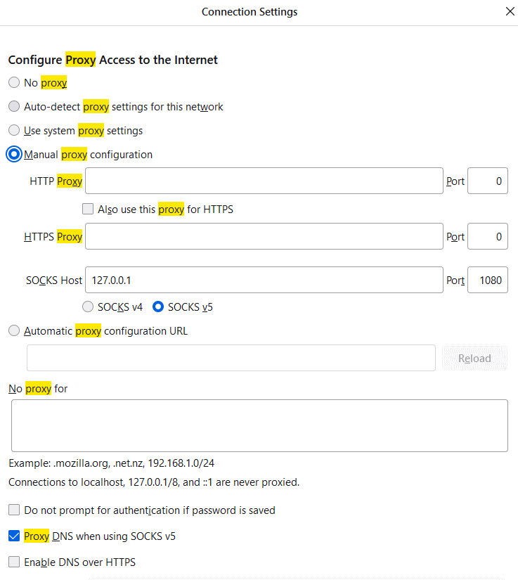

## Configure proxy

* Chrome:
    * Install [Proxy Switch Omega](https://chrome.google.com/webstore/detail/proxy-switchyomega/padekgcemlokbadohgkifijomclgjgif)
    * Go to options
    * Add http and https proxy server with
        * Address: 12.0.0.1
        * Port 1081.
      
          
    * Select "proxy" from the extension menu and back to "direct" when you want to disconnect
    * 
      
     
* Firefox
    * Navigate to [about:preferences](about:preferences)
    * Search for "proxy"
    * Click on "Settings"
    * Go to "Manual proxy Configuration"
    * Select the socks5 proxy
        * Address: 12.0.0.1
        * Port 1080
    * Check the "Proxy DNS when using SOCKS v5" flag
    * Clean the settings when needed
  
      