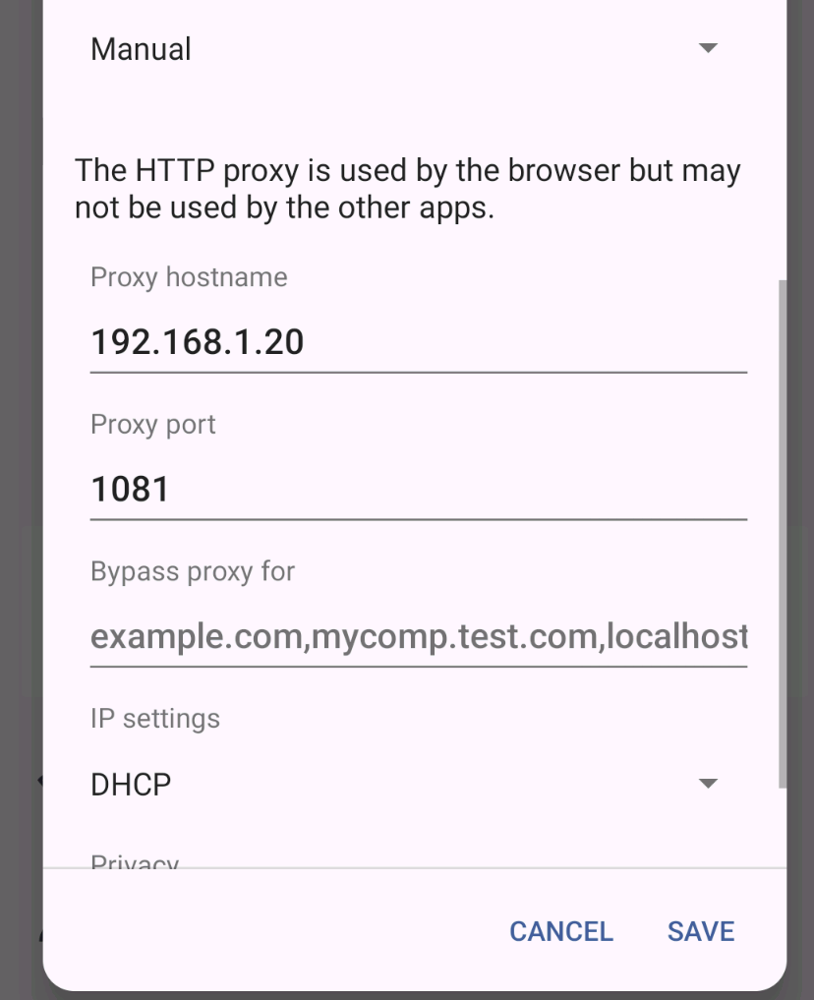

## Configure proxy

* Open your Android's Settings
* Tap Wi-Fi
* Solution 1
  * Tap and hold the Wi-Fi Network Name
  * Select Modify Network
* Solution 2
  * CLicke the wheel on the network name
  * Click the top right pen
* Click Advanced Options
* Tap Manual.
* Change your proxy's settings. Enter the hostname and proxy port (e.g. [yourPcIp]:1081)
* Tap Save.

