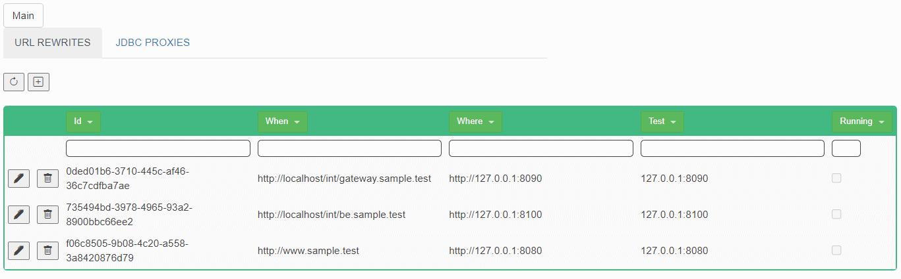

## Record some interaction

You can now check ham application going on http://www.local.test

* Going on [ham proxyes](http://www.local.test/proxy/index.html) you can verify that all proxies are ok if they don't work just "Refresh Status"

* Navigation on the [application](http://www.sample.test) you can try some interaction

* Then you can create a recording on the [recording page](http://www.local.test/plugins/recording)

* Once you create the recording you can start recording!

* Go then on the [application](http://www.sample.test) and do some interaction
* And stop the recording!
* Now you will se all the calls on the just created recording
