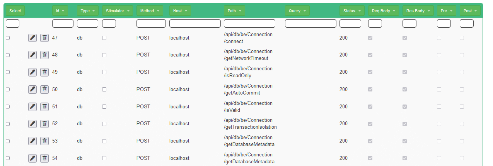

## Record some interaction

You can now check the configuration

* Going on [ham proxyes](http://www.local.test/proxy/index.html) you can verify that all proxies are ok if they don't work just "Refresh Status"

* And a db proxy for be

* Then you can create a recording on the [recording page](http://www.local.test/plugins/recording)

* Once you create the recording you can start recording! <b>CHECKING THE "Record db calls"</b>

* Now you can start the application on the command line :)

* Go then on the [application](http://www.sample.test) and do some interaction
  * Add an Employee "John Doe"
  * Go on Appointements
  * Add an Appointment with "Doctor" as description
  * Change the state of the appointament till it shows "Confirmed"
  * Delete the appointment
  * Back on employee, delete the employee too
* And stop the recording!
* Now you will se all the calls on the just created recording
* First the hibernate initialization phase

* ..or see how an employee is created. 
  * First a post to the gateway
  * Forwarded to the be
  * Then the be opens the connections and run the query

* You can even see the details of the queries there are many visualisations available
  * JSON: the native format of Janus-Jdbc (editable)
  * Component: the "easy editable visualisation", when available
  * Tree: the structure of the json message (that include the data types)

Analyzing the Json we identify a prepared statement with one Long parameter with 
set the index 1 (the first to set JDBC prepared statement parameters)

<pre>
{
	"command": {
		"sql": "
            select 
              employee0_.id as id1_1_0_, 
              employee0_.name as name2_1_0_, 
              employee0_.role as role3_1_0_ 
            from 
              employee employee0_ 
            where employee0_.id=?",
		":sql:": "java.lang.String",
		"parameters": [
			{
				"_": {
					"columnindex": 1,
					":columnindex:": "java.lang.Integer",
					"value": 0,
					":value:": "java.lang.Long"
				},
				":_:": "org.kendar.janus.cmd.preparedstatement.parameters.LongParameter"
			}
		],
		":parameters:": "java.util.ArrayList"
	},
	":command:": "org.kendar.janus.cmd.preparedstatement.PreparedStatementExecuteQuery"
}
</pre>

* "Download" the recording as "FullDb.json"
* You can now delete all the request with at least one of the following, leavin only db calls
  * Host: www.sample.test
  * Path: /int/
* "Download" the recording as "DbOnly.json"
* Now stop the H2 database and the BE application
* Start replaying the recording with "Play"
* Restart the BE with the be.bat/sh
* When the initialisation is complete go again of www.sample.test and redo all the steps (John Doe etc)
* Everything will work :D

