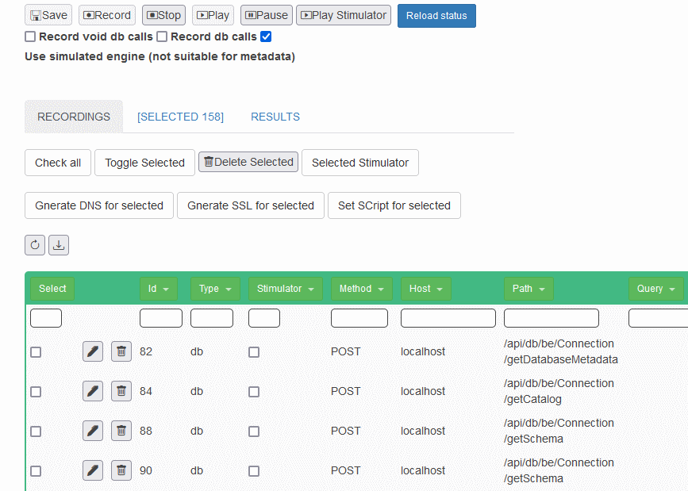
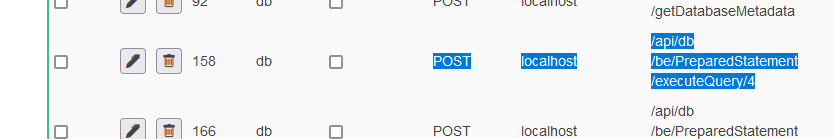
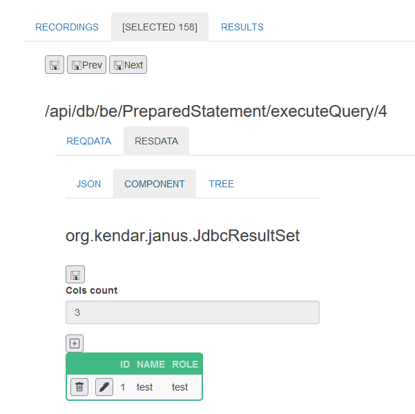
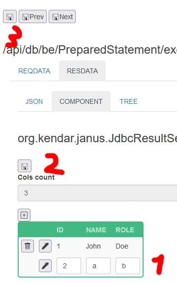

## Replay everything!

* Select all 'http' type calls and delete them

* "Download" the recording as "SimplifiedDb.json"
* Look for the first PreparedStatement/executeQuery and edit it

* Go then on RESDATA/COMPONENT

* Add a row (1), save the JdbcResultSet (2) and the Selected item (3)

* Stop the benogen
* Play the recording with the "Use simulated engine" checked

* Restart the benogen!
* Go on www.sample test and be happy :)

