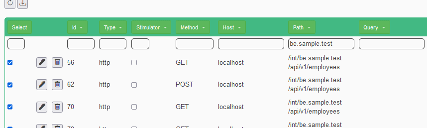

* [Dynamic testing](docs/generated/autodynamictest.md) 10 minutes
    * Run the sample application (1 fe, 2 be)
    * Record the interactions
    * Use internal context variables to verify -EXACT- content

### Test the BE in isolation (stateful) - and fail miserably

It will work after the next chapter!

* Stop the application and restart!
* Delete the script and re-upload Sample.json
* Stop the "fe" application
* Stop the "gateway" application
* Select all the calls to http://localhost/int/be.sample.test with the filter and set them as "Stimulator"

* Remove all the gateway and www.sample test calls

* Add the verification of the message on the "Stimulator" page
* Download and save the script as NullBeFailing.json
* Run the null test
* Check the results!
* Re-run it and... see errors

### Setup the statefulness

* Add variables here and there
* Download and save the script as PactBeDynamic.json
* Run the pact test
* Check the results!
* Re-run it multiple times and see Successes