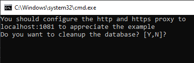
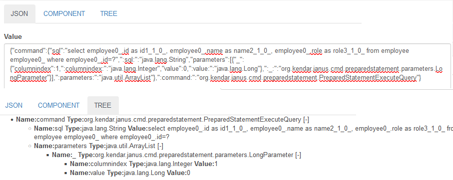
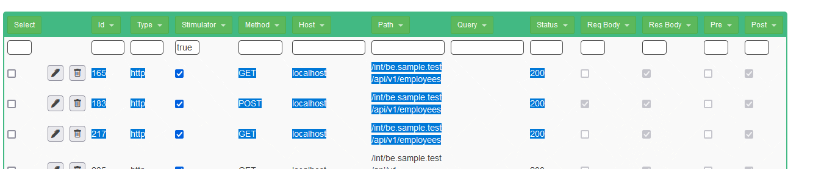

<!--This file is autogenerated. Do not edit!-->
In this demo you will 

* Start locally HAM server
* Start the sample application
* Connect to it through proxy
* Record the db interactions of the sample application
* Test the backend application without db, automatically

For more infos [check here](../generated/testcalendar_internals.md)

## Download the last release

Download the two tar.gz, ham and ham-samples from [github releases](https://github.com/kendarorg/HttpAnsweringMachine/releases)
and extract them in the same directory

## Starting the sample application

Go on the "calendar" directory and run "runcalendardbproxy.bat/sh"

This will start

* H2 db server (tcp://localhost:9123, web console http://localhost:8082)
* ham (localhost:80)
* be (localhost:8100) proxied by http://localhost/int/be.sample.test
* gateway (localhost:8090) proxied by http://localhost/int/gateway.sample.test
* fe (localhost:8080)

First you should choose if you want to recreate the db go for Y the first time

Then you will have to wait a bit. Now DO NOT START THE BE!!

## The calendar sample project

It's composed of three parts

* FE, that calls gateway for all its needs
* GATEWAY, that acts a "middleman" between FE and BE
* BE, with the database that is called only by the GATEWAY
## Configure proxy

* Chrome:
    * Install [Proxy Switch Omega](https://chrome.google.com/webstore/detail/proxy-switchyomega/padekgcemlokbadohgkifijomclgjgif)
    * Go to options
    * Add http and https proxy server with
        * Address: 127.0.0.1
        * Port 1081.
      
          
    * Select "proxy" from the extension menu and back to "direct" when you want to disconnect
    * 
      
     
* Firefox
    * Navigate to [about:preferences](about:preferences)
    * Search for "proxy"
    * Click on "Settings"
    * Go to "Manual proxy Configuration"
    * Select the socks5 proxy
        * Address: 127.0.0.1
        * Port 1080
    * Check the "Proxy DNS when using SOCKS v5" flag
    * Clean the settings when needed
  
      
## Record some interaction

You can now check the configuration

* Going on [ham proxyes](http://www.local.test/proxy/index.html) you can verify that all proxies are ok if they don't work just "Refresh Status"

* And a db proxy for be

* Then you can create a recording on the [recording page](http://www.local.test/plugins/recording)

* Once you create the recording you can start recording! <b>CHECKING THE "Record db calls"</b>

* Now you can start the application on the command line :)

* Go then on the [application](http://www.sample.test) and do some interaction
  * Add an Employee "John Doe"
  * Go on Appointements
  * Add an Appointment with "Doctor" as description
  * Change the state of the appointament till it shows "Confirmed"
  * Delete the appointment
  * Back on employee, delete the employee too
* And stop the recording!
* Now you will se all the calls on the just created recording
* First the hibernate initialization phase

* ..or see how an employee is created. 
  * First a post to the gateway
  * Forwarded to the be
  * Then the be opens the connections and run the query

* You can even see the details of the queries there are many visualisations available
  * JSON: the native format of Janus-Jdbc (editable)
  * Component: the "easy editable visualisation", when available
  * Tree: the structure of the json message (that include the data types)

Analyzing the Json we identify a prepared statement with one Long parameter with 
set the index 1 (the first to set JDBC prepared statement parameters)

<pre>
{
	"command": {
		"sql": "
            select 
              employee0_.id as id1_1_0_, 
              employee0_.name as name2_1_0_, 
              employee0_.role as role3_1_0_ 
            from 
              employee employee0_ 
            where employee0_.id=?",
		":sql:": "java.lang.String",
		"parameters": [
			{
				"_": {
					"columnindex": 1,
					":columnindex:": "java.lang.Integer",
					"value": 0,
					":value:": "java.lang.Long"
				},
				":_:": "org.kendar.janus.cmd.preparedstatement.parameters.LongParameter"
			}
		],
		":parameters:": "java.util.ArrayList"
	},
	":command:": "org.kendar.janus.cmd.preparedstatement.PreparedStatementExecuteQuery"
}
</pre>

### Replay everything!

* "Download" the recording as "FullDb.json"
* You can now delete all the request with at least one of the following, leaving only db calls
  * Host: www.sample.test
  * Path: /int/gateway
* "Download" the recording as "BeOnly.json"
* Stop frontend, be and gateway
* Select all the /int/be calls, check all of them and mark them as stimulator (and save!)

* Select all the "Stimulator" calls (use "true" as filter on the "Stimulator" column)
* Use the global Edit JS and set for all call the verification script in the "post" part. The last part is because running in isolation, without generated values we want ALL data to be the same

<pre>
    var diffEngine = new org.kendar.xml.DiffInferrer();
    diffEngine.diff(expectedresponse.getResponseText(),response.getResponseText());
    if(expectedresponse.getStatusCode()!=response.getStatusCode()){
        throw "Expected status code "+expectedresponse.getStatusCode()+" but received "+response.getStatusCode();
    }

    if( (expectedresponse.getResponseText()+"")!=(""+response.getResponseText())){
   	  throw "Different responses";
    }
</pre>

* "Download" the recording as "BeNullTest.json"
* Start replaying the recording with "Play", when started
* Restart the BE with the be.bat/sh
* When the BE initialization is completed
* STart the "Play Stimulator test"
* Everything will work :D And you could find the correct result 

### Fail to be sure

* Shutdown the BE
* Select the first get after the post on the /int/be (after the employee insertion)

* Change the response to something "wrong"

* Again
* Start replaying the recording with "Play", when started
* Restart the BE with the be.bat/sh
* When the BE initialization is completed
* STart the "Play Stimulator test"
* When the test is finished you can find the test... failed!

  
