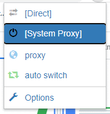
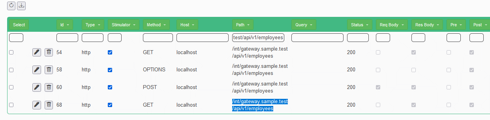
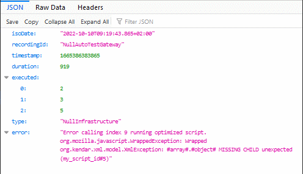

<!--This file is autogenerated. Do not edit!-->
In this demo you will 

* Start locally HAM server
* Start the sample application
* Connect to it through proxy
* Record the interactions of the sample application
* Setup a null-infrastructure test with automatic consistency verification. Testing automatically with
* Simulated Front-end with Back-end
  * Verify the message structures and auto test
  * Edit a request/response to force a fail

For more infos [check here](../generated/testcalendar_internals.md)

## Download the last release

Download the two tar.gz, ham and ham-samples from [github releases](https://github.com/kendarorg/HttpAnsweringMachine/releases)
and extract them in the same directory

## Starting the sample application

Go on the "calendar" directory and run "runcalendar.bat/sh"

This will start

* ham (localhost:80)
* be (localhost:8100) proxied by http://localhost/int/be.sample.test
* gateway (localhost:8090) proxied by http://localhost/int/gateway.sample.test
* fe (localhost:8080)

## The calendar sample project

It's composed of three parts

* FE, that calls gateway for all its needs
* GATEWAY, that acts a "middleman" between FE and BE
* BE, with the database that is called only by the GATEWAY
## Configure proxy

* Chrome:
    * Install [Proxy Switch Omega](https://chrome.google.com/webstore/detail/proxy-switchyomega/padekgcemlokbadohgkifijomclgjgif)
    * Go to options
    * Add http and https proxy server with
        * Address: 127.0.0.1
        * Port 1081.
      
          
    * Select "proxy" from the extension menu and back to "direct" when you want to disconnect
    * 
      
     
* Firefox
    * Navigate to [about:preferences](about:preferences)
    * Search for "proxy"
    * Click on "Settings"
    * Go to "Manual proxy Configuration"
    * Select the socks5 proxy
        * Address: 127.0.0.1
        * Port 1080
    * Check the "Proxy DNS when using SOCKS v5" flag
    * Clean the settings when needed
  
      
## Record some interaction

You can now check ham application going on http://www.local.test

* Going on [ham proxyes](http://www.local.test/proxy/index.html) you can verify that all proxies are ok if they don't work just "Refresh Status"

* Navigation on the [application](http://www.sample.test) you can try some interaction

* Then you can create a recording on the [recording page](http://www.local.test/plugins/recording)

* Once you create the recording you can start recording!

* Go then on the [application](http://www.sample.test) and do some interaction
  * Add an Employee "John Doe"
  * Go on Appointements
  * Add an Appointment with "Doctor" as description
  * Change the state of the appointament till it shows "Confirmed"
  * Delete the appointment
  * Back on employee, delete the employee too
* And stop the recording!
* Now you will se all the calls on the just created recording

* "Download" the recording as "Sample.json"

## Automatically test and verify backend

### Run the interaction with back-end (stateless) and test the GATEWAY in isolation

* Stop the application and restart!
* Delete the script and re-upload Sample.json
* Stop the "fe" application
* Stop the "be" application

* Select all the calls to path /int/gateway.sample.test with the filter and set them as "Stimulator". These will be run automatically.

* Run the test
* Check the results on the results tab!

### Verify the content structure

* Select all the "Stimulator" calls (use "true" as filter on the "Stimulator" column)
* Use the global Edit JS and set for all call the verification script in the "post" part

<pre>
    var diffEngine = new org.kendar.xml.DiffInferrer();
    diffEngine.diff(expectedresponse.getResponseText(),response.getResponseText());
    if(expectedresponse.getStatusCode()!=response.getStatusCode()){
        throw "Expected status code "+expectedresponse.getStatusCode()+" but received "+response.getStatusCode();
    }
</pre>

* Replay And be happy
* Check the [results](http://www.local.test/plugins/recording/results.html)!
* Download and save the script as NullAutoTestGateway.json

### Fail the test! To verify it's real

* Find the response to a front-end call. A good example can be the first get call to the "/int/gateway.sample.test/api/v1/employees" after the POST inserting the new employee

* Click on the Edit button on the list and open the Request/Response editor

* Replace then the response data with something like this. Adding the field "unexpected"

<pre>
[{"id":1,"name":"John","role":"Doe","unexpected":"field"}]
</pre>

* Run the test again
* Check the FAILED results! Notice that the field "unexpected" is the one we added!

