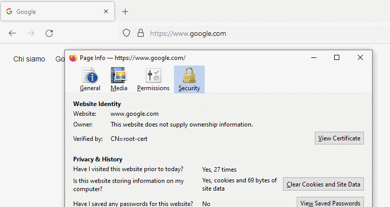
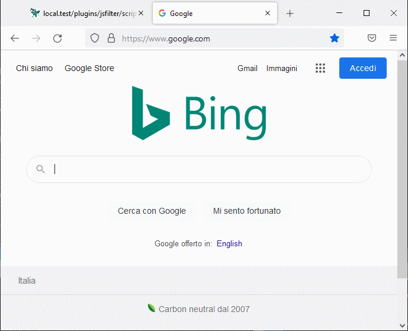

<!--This file is autogenerated. Do not edit!-->
In this demo you will 

* Start locally HAM server
* Connect to it through proxy
* Intercept Google calls and replace the logo!

## Download the last release

Download the tar.gz, ham only from [github releases](https://github.com/kendarorg/HttpAnsweringMachine/releases)
and extract it

## Starting the sample application

Go on the "ham" directory and run "proxy.run.bat/sh"

This will start ham with all services

## Install SSL root certificate

Download [the certificate](http://www.local.test/api/certificates/ca.der)
Open the zip file and install as "Root certificate authority"

* Firefox:
    * Go on Settings and search for certificates
    * Then "View certificates" and "Import"
    * Check "Trust to identify websites"
* Chrome:
    * Go on Settings and search for certificates
    * Open the "Security" and "Manage certificates" then "Import"
    * "Place all certificates in the following store" then "Browse"
    * Select the "Trusted Root Certification Authorities"

## Intercept Google!

Go on the [certificates configuration page](http://www.local.test/certificates/index.html)
and add a new website with value www.google.com

Add a new dns mapping on the [dns configuration](http://www.local.test/dns/index.html) with

* ip: 127.0.0.1
* dns: www.google.com

Restart the browser to be sure that all DNS caches are cleaned!

Go on https://www.google.com

When you click on the locker near the address you will see that the website
certificate is generated through "CN=root-cert"... OUR AUTHORITY :)

## Bing-ify google!

Go on the [js-filters plugin](http://www.local.test/plugins/jsfilter/index.html) and
create a "Google" filter.

* Phase: POST_CALL (change the content received)
* Host Address: www.google.com
* Path Address: /
* Script. Notice the "" added to the response text, this is just to force a cast from Java String to Javscript string
<pre>
var regex=/\/images\/branding\/[_a-zA-Z0-9]+\/[_a-zA-Z0-9]+\/[_a-zA-Z0-9]+\.png/gm;
var responseText = response.getResponseText()+"";
var changedText = responseText.replace(regex,'https://upload.wikimedia.org/wikipedia/commons/thumb/c/c7/Bing_logo_%282016%29.svg/320px-Bing_logo_%282016%29.svg.png');
response.setResponseText(changedText);
return false;
</pre>

Navigate to https://www.google.com with BING! logo :D

