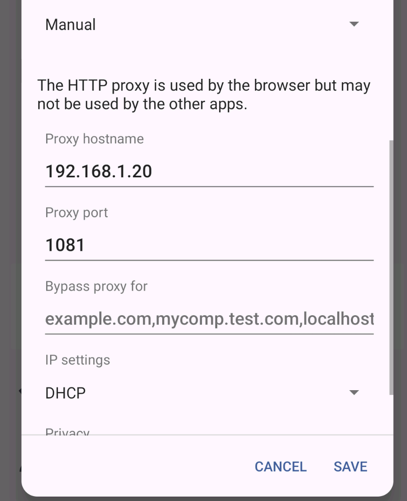
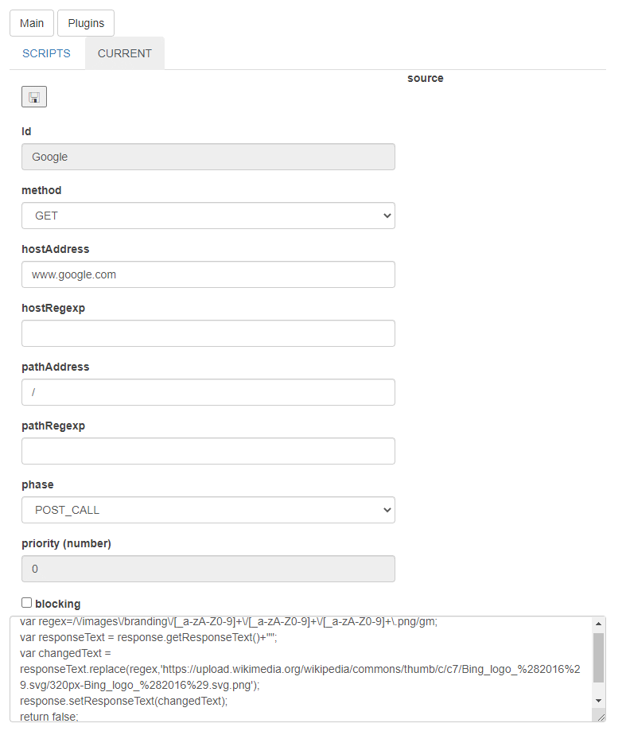

<!--This file is autogenerated. Do not edit!-->
In this demo you will 

* Start locally HAM server
* Install the HAM certificate on Android
* Connect to HAM through proxy
* Intercept all Android DNS calls
* Intercept Google calls and replace the logo!

For more info [look here](../generated/googlehack_internals.md)!

**Remember to open the 1080 and 1081 ports on the machine with the HAM running!!**

## Download the last release

Download the tar.gz, ham only from [github releases](https://github.com/kendarorg/HttpAnsweringMachine/releases)
and extract it

## Starting the sample application

Go on the "ham" directory and run "proxy.run.bat/sh"

This will start ham with all services

## Install SSL root certificate 

Download [the certificate](http://www.local.test/api/certificates/ca.der)

Open the zip file and send it via mail to your phone

* Send via mail the .der file
* Download it on your phone
* Open your phone's Settings app
* Solution 1
    * Tap Security Advanced
* Solution 2
    * Security settings
* Tap Encryption & credentials
* Tap Install a certificate. Wi-Fi certificate
* In the top left, tap Menu
* Tap where you saved the certificate
* Tap the file. If needed, enter the key store password
* Select it as a CA Root Authority
* Enter a name for the certificate
* Tap OK

## Configure proxy

* Open your Android's Settings
* Tap Wi-Fi
* Solution 1
  * Tap and hold the Wi-Fi Network Name
  * Select Modify Network
* Solution 2
  * CLicke the wheel on the network name
  * Click the top right pen
* Click Advanced Options
* Tap Manual.
* Change your proxy's settings. Enter the hostname and proxy port (e.g. [yourPcIp]:1081)
* Tap Save.

## Intercept Android

You can now use some app, browse some page. You can check the DNS names 
captured by ham [here](http://www.local.test/dns/resolved.html)

Notice how many stuffs your phone is accessing!
Here I used (to give an example). 

* Chrome
* Slack App
* Linkedin App
## Intercept Google!

Go on the [certificates configuration page](http://www.local.test/certificates/index.html)
and add a new website with value www.google.com

Add a new dns mapping on the [dns configuration](http://www.local.test/dns/index.html) with

* ip: 127.0.0.1
* dns: www.google.com

Restart the browser to be sure that all DNS caches are cleaned!

Go on https://www.google.com

When you click on the locker near the address you will see that the website
certificate is generated through "CN=root-cert"... OUR AUTHORITY :)

On Firefox

Or on Android Chrome

## Bing-ify google!

Go on the [js-filters plugin](http://www.local.test/plugins/jsfilter/index.html) and
create a "Google" filter.

* Phase: POST_CALL (change the content received)
* Host Address: www.google.com
* Path Address: /
* Script. Notice the "" added to the response text, this is just to force a cast from Java String to Javscript string
<pre>
var regex=/\/images\/branding\/[_a-zA-Z0-9]+\/[_a-zA-Z0-9]+\/[_a-zA-Z0-9]+\.png/gm;
var responseText = response.getResponseText()+"";
var changedText = responseText.replace(regex,'https://upload.wikimedia.org/wikipedia/commons/thumb/c/c7/Bing_logo_%282016%29.svg/320px-Bing_logo_%282016%29.svg.png');
response.setResponseText(changedText);
return false;
</pre>

Navigate to https://www.google.com with BING! logo :D

On Firefox

On Android

