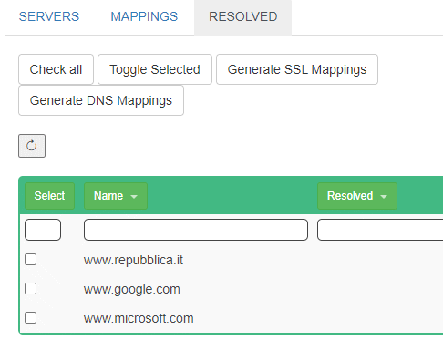
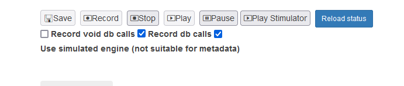

If you want to record both db and http interactions just follow both the paths before
starting recording

ALL RECORDINGS CAN BE CHANGED AND EDITED!

## Web Recording

An [example](../../generated/localsample.md) 

### Setup Local standalone

This approach require that you can change the rest api addresses called by your application

* Create the proxies for your addresses. Notice the "/int" path. If you don't use this the calls will not be recorded! An example could be the following, that redirects to google.com
  * When: https://localhost/int/www.google.com
  * Then: https://www.google.com
  * Test: www.google.com

 

* Change on your application the servers to the corresponding Whens

### Setup With DNS Hijacking - Known hosts

If you are running the application into a container (and therefore uses ) or wants to record
the interactions from a phone, but you know the hosts

* Add the DNS on the dns Mappings
* ADd the names on the SSL Websites section

### Setup With DNS Hijacking - Unknown hosts

If you are running the application into a container (and therefore uses ) or wants to record
the interactions from a phone, and you have no idea of the hosts called

<B>Setup the clients</b>

* If recording phones, setup the phone to connect to the HAM vpn or with the Http/Https/Socks proxyes and install the SSL certificate on the phone
* You can connect to the VPN on the container -if it runs on a different machine-
* Connect via Browser proxy if you can handle it with an UI
* Configure the proxy for your curl calls if you wanna go through command line

<b>Capture the DNSs</b>

* Run then your tests that will contact the real servers
* You can find on the DNS section the list of resolved addresses

 

* Select all the addresses you are interested
* Generate SSL Mappings
* Generate DNS Mappings

### Run!

Then you can create a new recording and start recording!

## Db Recording

* Instruct you application to use JanusJdbc and add the relevant proxies [here](../../jdbc.md)
* Check the record DB calls
* Choose if you want to Record void db calls: Void methods are completely mocked. If you want you can ask ham to record them too (for inspection reasons)

Please note that if you start the application -before- starting the recording, you will need
the real database when doing the test. If you instead start the recording -before- the
application under test you will record even all the initialisations and you will not need
<B>ANY DATABASE AT ALL</b>

### Simpler recording 

You can choose to simulate the "non data" related calls it's enough to check the flag during recording (AND REPLAYING)

### Editing data

You can edit the resultsets adding/removing columns! The engine will handle the datatypes conversions for you

### Notes:

The replayer and recorder filters has a priority of 200

